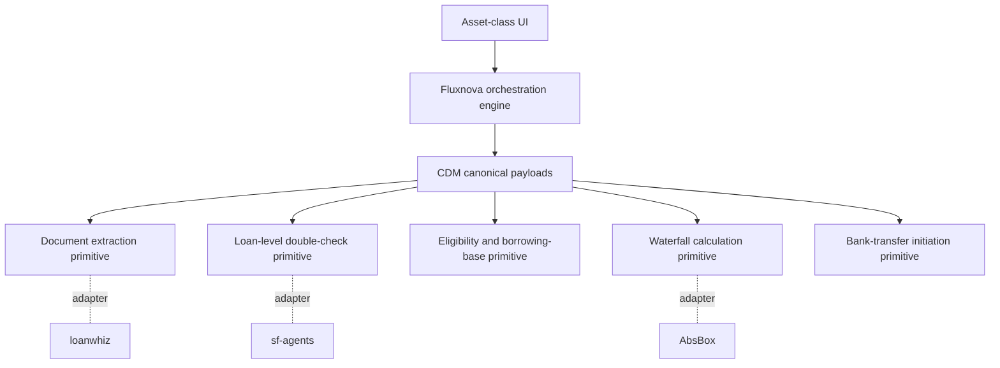

# Cascade Finance

Cascade Finance is an enterprise-ready calculation-agent reference application for structured-finance operations. It demonstrates how an asset-class UI can drive a Fluxnova-style orchestration engine that invokes reusable primitives through FINOS Common Domain Model (CDM)-inspired messages.

## What the customer can review

- **Asset-class UI:** a warehouse / ABS funding dashboard that makes waterfalls, borrowing-base logic, eligibility checks, evidence, and operator approvals visible.
- **Orchestration engine:** a deterministic Fluxnova-inspired workflow that routes normalized CDM payloads between primitives and records audit evidence for each step.
- **Primitive adapters:** swappable adapters modeled after LoanWhiz, sf-agents, AbsBox, and bank-transfer integrations.
- **Practitioner primitives:** prospectus / investor-report extraction, loan-level validation, eligibility checks, borrowing-base sizing, waterfall allocation, and controlled bank-transfer initiation.

## Architecture



## Run locally

```bash
npm install
npm run dev
```

## Validation

```bash
npm run build
npm test
```
